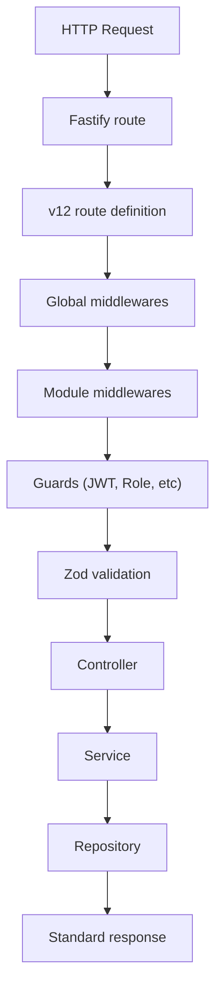

# Arquitetura Interna

O `v12` é um framework backend orientado a features, desenhado para manter cada funcionalidade o mais independente possível, reduzir o acoplamento e facilitar testes e extensões.

## 1. Visão Geral

A arquitetura foi desenhada para:
- Manter cada feature o mais independente possível.
- Reduzir acoplamento entre regras HTTP e regra de negócio.
- Facilitar testes unitários e de integração.
- Permitir extensão por plugins e adapters.

## 2. Estrutura Conceitual

```txt
Application
  -> Features (Domínio do negócio)
  -> Core (Primitivas do framework)
  -> Shared (Utilitários reutilizáveis)
```

### Core
Contém as primitivas: HTTP, DI, config, erros, logger, auth, events, jobs, testing e swagger.

### Features
Contém as funcionalidades do domínio: users, auth, products, orders, etc.

## 3. Unidade Principal: Feature

No `v12`, a feature é a unidade arquitetural principal. Cada feature encapsula seu comportamento aproximando arquivos relacionados:
- module
- routes
- controller
- service
- repository
- schemas
- errors
- tests

## 4. Fluxo de Request



## 5. Responsabilidades por Camada

- **Routes**: Declarar método, path, schema e middlewares.
- **Controller**: Ler request, transformar input em chamada de aplicação e devolver output.
- **Service**: Orquestrar regra de negócio e validar comportamento de domínio.
- **Repository**: Encapsular persistência e abstrair fonte de dados.

## 6. Dependency Injection

O `v12` usa um container simples baseado em tokens e classes, suportando `useClass`, `useValue`, `useFactory` e child containers por request.

## 7. App Factory

`createApp()` monta a instância Fastify, logger, container, event bus, plugins, módulos e error handler.

## 8. Error & Validation Model

O framework utiliza Zod para validação de entrada e trabalha com uma hierarquia de erros orientada a API (`AppError`, `ValidationError`, etc), garantindo respostas padronizadas.

## 9. CLI Architecture

A CLI é dividida em **Entrada** (parse de argumentos e output) e **Scaffold** (geração e remoção de arquivos, registros de módulos e recursos CRUD).

## 10. Regra de Ouro

Se um componente precisar existir, a pergunta principal é: **"isso pertence ao core do framework ou a uma feature?"**. Se pertencer a uma feature, deve viver na feature. Se for transversal e reutilizável, deve viver no core.
