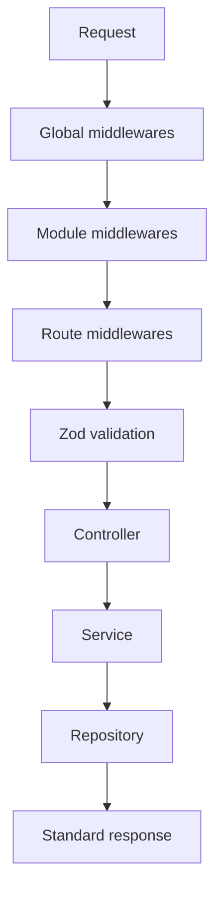

# Request Pipeline

Resumo curto

O request pipeline define como uma chamada HTTP atravessa o framework.

## Diagrama

## Erros comuns

- autenticação em service quando deveria ser middleware
- validação manual duplicada

## Links relacionados

- [Execution](/concepts/execution)
- [createRouter](/api/create-router)
