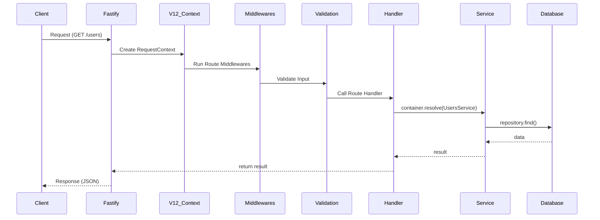

# Execution

Execution refere-se ao caminho que uma requisição percorre dentro do V12, desde o momento em que atinge o servidor até a entrega da resposta ao cliente. Entender esse fluxo é crucial para depuração e para posicionar corretamente lógicas customizadas.

## O Pipeline de Execução

O fluxo de execução é composto por várias camadas, cada uma com uma responsabilidade específica:

1.  **Transporte (Fastify)**: A requisição chega via TCP/HTTP. O Fastify faz o parse inicial dos headers e do body.
2.  **Context Injection**: O V12 intercepta a requisição e cria o `RequestContext`. Aqui, o Child Container é instanciado e o Logger é preparado com o ID da requisição.
3.  **Hooks Globais de Pré-Processamento**: Middlewares registrados globalmente no Fastify (como compressão ou logs de acesso) são executados.
4.  **Route Dispatcher**: O V12 identifica a rota correspondente à URL e ao método HTTP.
5.  **Middlewares de Rota**: Os middlewares definidos na propriedade `middlewares` da rota são executados sequencialmente. Se um middleware lançar um erro ou enviar uma resposta, o pipeline é interrompido.
6.  **Security Guards**: Verificações de autenticação e autorização são realizadas.
7.  **Input Validation**: Os schemas de validação (Zod/Schema) são aplicados. Se a validação falhar, um `400 Bad Request` é retornado automaticamente.
8.  **Handler**: A função `handler` principal é chamada. É aqui que você geralmente resolve um Service do container e executa a regra de negócio.
9.  **Output Serialization**: O retorno do handler é processado pelo Fastify, convertido para JSON e os cabeçalhos de resposta são finalizados.
10. **Post-Processing & Cleanup**: O Child Container é destruído e métricas de telemetria (como duração da requisição) são registradas.

## Diagrama de Sequência

## Tratamento de Erros no Fluxo

O V12 possui um Error Handler global. Qualquer erro lançado em qualquer ponto do pipeline (Middlewares, Validation, Handler ou Service) será capturado:

-   Se for um `AppError` ou sub-classe: O status code e a mensagem definidos serão usados.
-   Se for um erro inesperado: Um `500 Internal Server Error` é retornado e o erro completo é logado para investigação.

## Links relacionados

- [Lifecycle](/concepts/lifecycle)
- [Request Pipeline Architecture](/architecture/request-pipeline)
- [Errors API](/api/errors)
